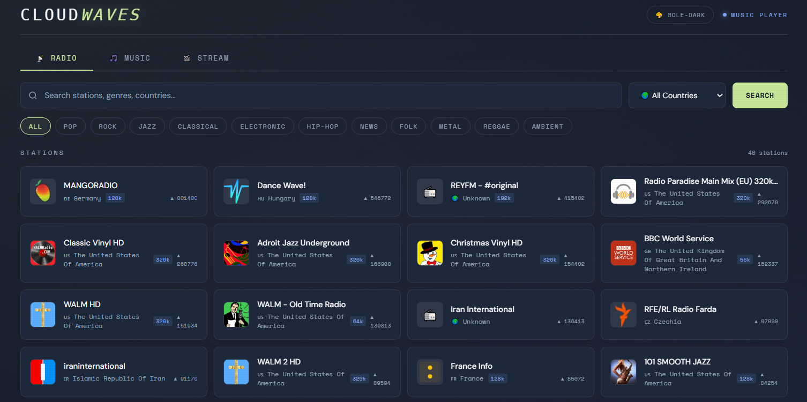
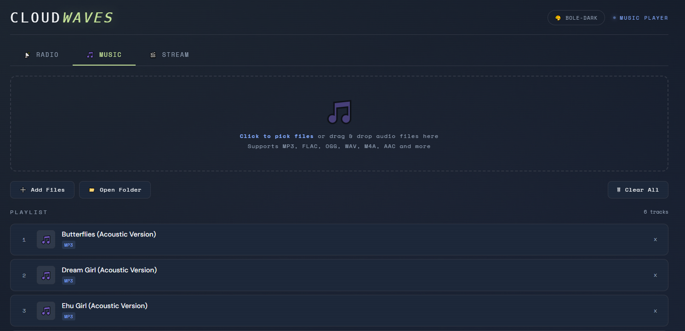
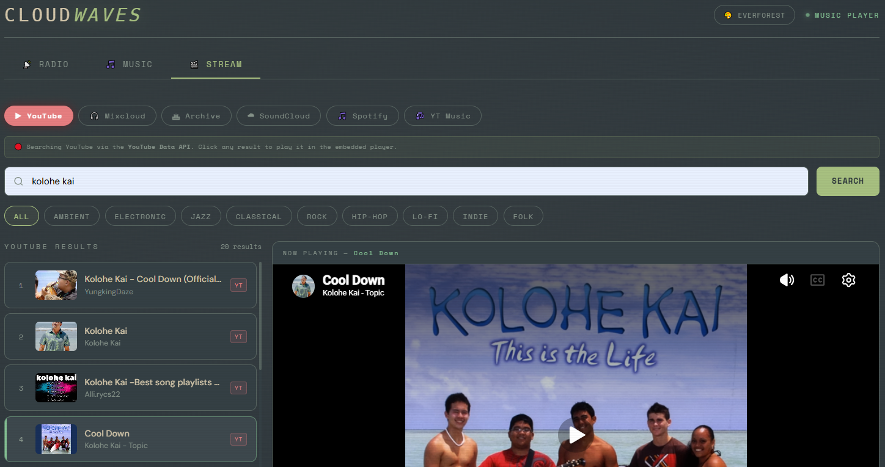

# ArchBoki Player — CloudWaves

A web-based music player built with Astro that lets you search and stream tracks from YouTube, Mixcloud, and Internet Archive, play local audio files, and listen to curated radio stations — all in one place.





## 🚀 Project Structure

Inside of your Astro project, you'll see the following folders and files:

```text
/
├── public/
│   └── favicon.svg
├── src
│   ├── assets
│   │   └── astro.svg
│   ├── components
│   │   └── Welcome.astro
│   ├── layouts
│   │   └── Layout.astro
│   └── pages
│       └── index.astro
└── package.json
```

To learn more about the folder structure of an Astro project, refer to [our guide on project structure](https://docs.astro.build/en/basics/project-structure/).

## 🧞 Commands

All commands are run from the root of the project, from a terminal:

| Command                   | Action                                           |
| :------------------------ | :----------------------------------------------- |
| `npm install`             | Installs dependencies                            |
| `npm run dev`             | Starts local dev server at `localhost:4321`      |
| `npm run build`           | Build your production site to `./dist/`          |
| `npm run preview`         | Preview your build locally, before deploying     |
| `npm run astro ...`       | Run CLI commands like `astro add`, `astro check` |
| `npm run astro -- --help` | Get help using the Astro CLI                     |


## �👀 Want to learn more?

Feel free to check [our documentation](https://docs.astro.build) or jump into our [Discord server](https://astro.build/chat).
